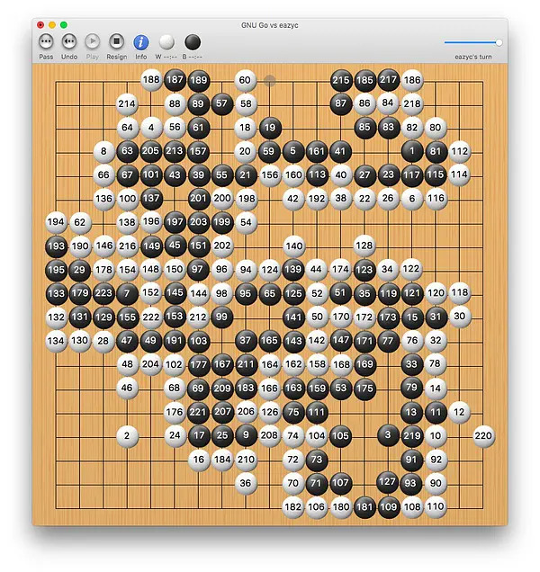

## 缘起

对于初学者来说，围棋的难点在于布局。做了一些“死活题”“吃子题”“手筋题”，简单的基本都能答对，但当试着开局对弈时，面对一整面空白的大棋盘，完全不知所措。

初学者（或者说所有人都）不可能单凭推理和演算来看到布局阶段下子所导致的最终结果（计算机也难以演算，AlphaGo 依赖的是人工神经网络），所以基本无从下手。

此处扯下淡：围棋棋盘是 19\*19 的变化基数，人生呢？也许先模仿一个曾经的成功者的青少童年来成长（布局出一个趋向于曾经成功过的棋形），再基于所习得的技能、获得的资源去发展和变化时才能逐渐看清自己（中盘变化与交战）。如果幸运和足够努力，人生会逐渐有一个非常明确的方向，便可使出全力去追逐（官子确立竞逐边界）。

看了布局常识后，和电脑下了一局，努力思考并通过数次悔棋才勉强争得一两片小地盘，四角完全被电脑占领了，中后盘才大概看出点端倪为啥之前电脑会下那里、下那里以及下那里。

上面我的第一局完整的棋（电脑执白），输到没朋友，但觉得很好玩。

这款围棋软件是 Mac 上的围棋 App，叫做 [Goban](http://www.sente.ch/software/goban3/ "Goban")，可以试用。里面的 AI 叫做 [GNU Go](http://www.gnu.org/software/gnugo/)，据说棋力不高，但对我来说简直有着深不见底的功力。其中，GNU 就是那个以创造一套完全自由的操作软件为目标的 GNU。

## 围棋怎么点目

围棋被认为是世界上最复杂的棋盘游戏，规则却出奇的简单，网上搜索一下就知道，也就几条，麻烦的是点目。很多人也许知道怎么下棋，可是不知道怎么判断胜负，也就是怎么点目。

关于点目，我一直很模糊，但看了下面这幅图就很清楚了：

以下加起来就是总目数（对应上图中左边统计栏）：

- 领地：围起来的空点，不包括有棋子的点（因此足够存活就好，不要在领地里下冗余的棋子）
- 提子：对方被提的棋子数
- 死子：棋盘上对方的死子数（如图中央的白棋）
- 贴目：黑方先行，为了公平，贴给白方的目数（此处为 6.5 目）

图中，黑方 74+11+21+0=106 目，白方 117+3+0+6.5=126.5 目，白方以 20.5 目胜出（差距蛮大的，正常情况下黑方在中盘应该会认输了）。

需要注意的是，点目规则有两种，中国规则和日本规则，上述是 Goban 采用的规则——日本规则。两者的关键区别是：对于己方存活的子，中国规则计入目数，日本规则不计入目数。

然而，现在是知道怎么点目了，但还是对那些可以仅凭肉眼看出精确目数的棋手惊叹不已，真想问：你们究竟是怎么操作的（充满惊叹和疑惑的表情）？