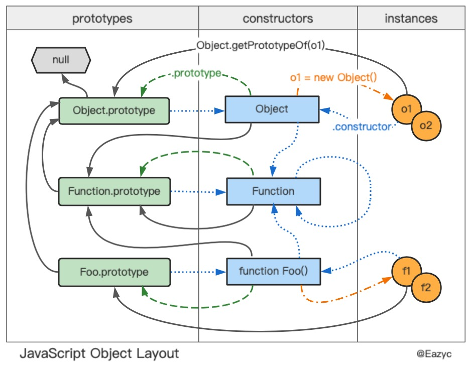

曾经迷惑于 js 的原型链问题，后来找了一张图—— [JavaScript Object Layout](http://www.mollypages.org/tutorials/js.mp)，事情马上就变得清晰开朗啦。根据原图，好奇的水獭补充了 constructor 的指向，挪动了里面一些元素的位置，绘制出了下面的图：



## `Object.prototype`

`Object.prototype` 是原型链的顶端，所有的对象都会继承它的属性和方法。

## `Object.prototype.constructor`

所有对象都继承了这个属性，属性值指向生成这个对象的构造函数，即 constructor。

所有函数（包括构造函数）的构造函数都是 Function （函数的构造函数），Function 的构造函数是它本身：

```js
Object.constructor === Function // true
Array.constructor === Function // true
Number.constructor === Function // true
Function.constructor === Function // true

function Foo() {}
Foo.constructor === Function // true
```

## `Object.prototype.__proto__`

所有对象都继承了这个属性，属性值指向这个对象的原型（限于浏览器环境）。

其实，将 `__proto__` 的指向连接起来，就是 JavaScript 的原型链。

> 注意：虽然 `__proto__` 在如今的浏览器环境中得到普遍支持，但直至今天它仍然没有完全标准化。想要获取一个对象的原型，建议使用 `Object.getPrototypeOf()` 方法。另外，也要尽量避免对 `__proto__` 赋值，而应该使用 `Object.create()` 方法来实现继承。

---

参考资料

- [JavaScript Object Layout](http://www.mollypages.org/tutorials/js.mp) by Hursh Jain
- [MDN web docs - JavaScript Object](https://developer.mozilla.org/en-US/docs/Web/JavaScript/Reference/Global_Objects/Object)