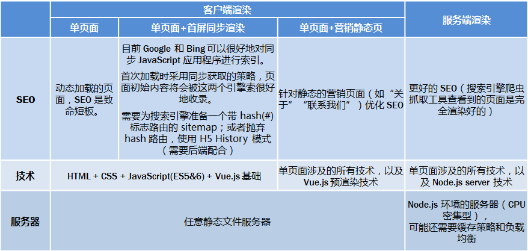
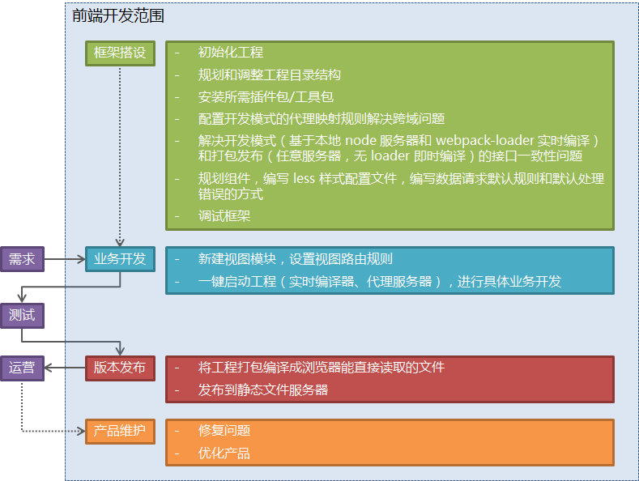
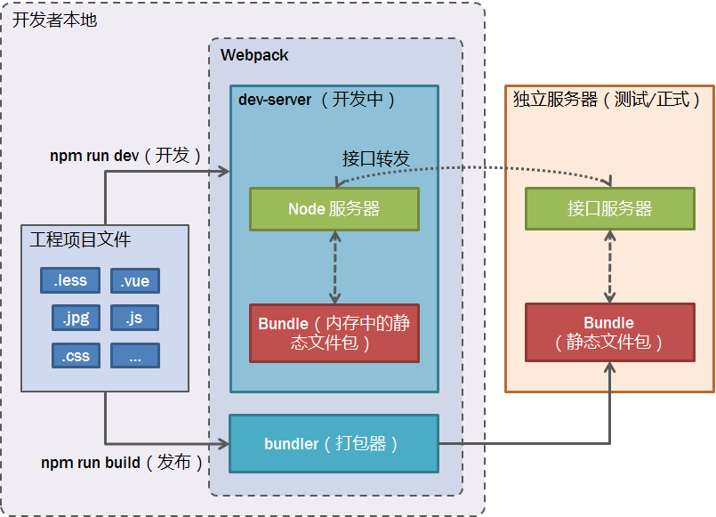

梳理了一下基于 Vue.js(v2) 工程化开发的方案和大致流程。如内容有误，请读着不吝指出（欢迎点击页面左下角的 GitHub 头像联系我）。

## 开发方案

关于 [Vue.js(v2)](https://cn.vuejs.org/) 的架构方案，大致有如下几种：

## 开发流程

大致的开发流程如下：

## 开发模式

关于工程化开发，主要需要熟悉 [webpack](https://doc.webpack-china.org/) （目前 [VueCLI](https://cli.vuejs.org/zh/) v3版本已集成了 webpack）。开发模式如下：

